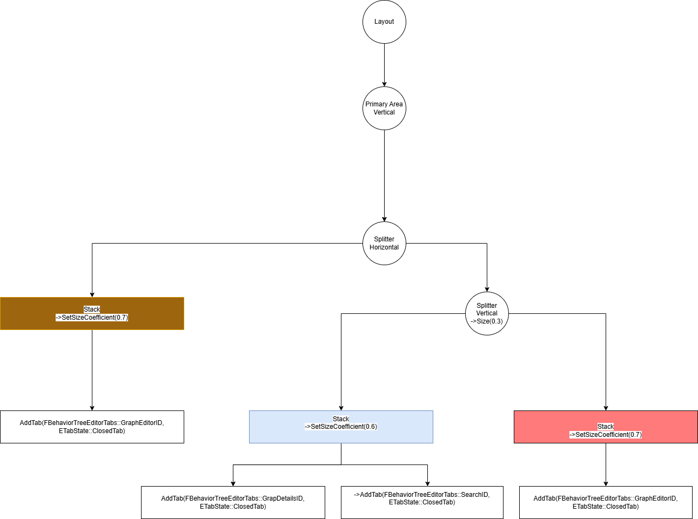
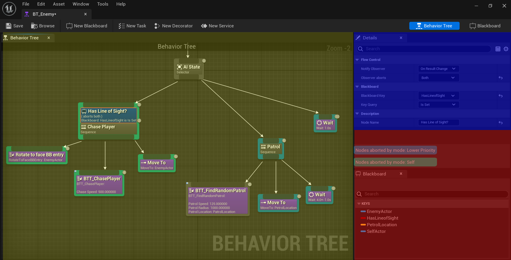

- [Özel Asset Editörler](#özel-asset-editörler)
- [Basit Asset Düzenleyicisi](#basit-asset-düzenleyicisi)
  - [InitAssetEditor](#initasseteditor)
    - [AppIdentifier](#appidentifier)
    - [StandaloneDefaultLayout](#standalonedefaultlayout)
      - [FArea](#farea)
      - [FSplitter](#fsplitter)
      - [FStack](#fstack)
    - [bCreateDefaultToolbar](#bcreatedefaulttoolbar)
    - [bCreateDefaultStandaloneMenu](#bcreatedefaultstandalonemenu)
  - [Tab Spawners](#tab-spawners)
    - [RegisterTabSpawners](#registertabspawners)
    - [UnregisterTabSpawners](#unregistertabspawners)
- [Ekler](#ekler)
  - [IToolkitHost](#itoolkithost)
  - [EToolkitMode](#etoolkitmode)
    - [Standalone](#standalone)
    - [WorldCentric](#worldcentric)

# Özel Asset Editörler
Asset düzenleyicileri(editörleri) C++ üzerinden oluşturulur. Bu editörler açılma isteği geldiğinde istediği UObject tipi objeleri düzenlemek/görüntülemek için kullanılabilir.

Asset düzenleyicileri şu kalıtım yapısını kullanır `ITookit -> FBaseToolkit -> FAssetEditorTookit`. `FWorkflowCentricApplication` da bir alt kalıtım seviyesidir ancak bunu daha detaylı asset editörler yazarken kullanırız, modlar gibi sistemleri kontrol ederken bu kolaylık sağlamak için kullanılır ancak basit düzenleyiciler bu modlara gerek duymaz.

# Basit Asset Düzenleyicisi
Bir asset düzenleyicisi için bir sınıf oluşturarak başlayalım
```cpp
class FBasitAssetDuzenleyici : public FAssetEditorToolkit{
    //...
    //...
    //...
    //...
};
```
Bu sınıf `FAssetEditorToolkit` in alt sınıfı olarak ayarlandı. Daha önceden belirttiğimiz gibi bu basit düzenleyiciler için iyi bir tercih olacaktır.
Bu düzenleyiciyi ayarlamak için içerisine ayarlayıcı bir fonksiyon ekleyelim.
```cpp
void InitEditor( const EToolkitMode::Type Mode, const TSharedPtr< class IToolkitHost >& InitToolkitHost, const TArray<UObject*>& ObjectsToEdit, FGetDetailsViewObjects GetDetailsViewObjects );
```
Burada `Mode` Ekler kısmında açıklandığı gibi düzenleyicinin açılacağı modu belirtir. Bu mod WorldCentric(Dünya Merkezli) veya Standalone(Yalnız) olabilir.

`InitToolkitHost` ise Ekler kısmında açıklandığı gibi düzenleyicinin açılacağı ortamı belirtir. Eğer Mode `WorldCentric` ise `ILevelEditor` olur değilse `SStandaloneAssetEditorToolkitHost` olur.

Şimdi ise bu fonksiyonu nasıl dolduracağımıza geçelim.
## InitAssetEditor
Bu oluşturulan fonksiyon üst sınıflardan birine ait değil. Yani Unreal Engine bu düzenleyiciyi varsayılan kuruluma ulaştırmak için bilgiye sahip değil. Bu yüzden Unreal Engine'e kurulum şansı vermek için 
```cpp
UNREALED_API void InitAssetEditor(const EToolkitMode::Type Mode, const TSharedPtr<IToolkitHost>& InitToolkitHost, const FName AppIdentifier, const TSharedRef<FTabManager::FLayout>& StandaloneDefaultLayout, const bool bCreateDefaultStandaloneMenu, const bool bCreateDefaultToolbar, const TArray<UObject*>& ObjectsToEdit, const bool bInIsToolbarFocusable, const bool bInUseSmallToolbarIcons, const TOptional<EAssetOpenMethod>& InOpenMethod);
```
fonksiyonunu çağırmamız gerekiyor. Burada şu anda eksik olan bir kaç bilgi var `AppIdentifier, StandaloneDefaultLayout, bCreateDefaultStandaloneMenu, bCreateDefeaultToolbar, ObjectsToEdit`.
Diğer bilgilere ya sahipiz ya da isteğe bağlı parametre olarak geçiyorlar (`const bool bInIsToolbarFocusable = false, const bool bInUseSmallToolbarIcons = false, const TOptional<EAssetOpenMethod>& InOpenMethod = TOptional<EAssetOpenMethod>()`).

### AppIdentifier
Eşsiz bir isim olmalıdır. Bu düzenleyiciyi bulmak için kullanılabilir olmalıdır. 
Genel olarak ProjeKısaİsim+Assetİsmi+"AssetEditor" kullanılabilir (tamamen tercih meselesi Unreal Engine veya bir pluginin app identifier'ına eşit olmadığı sürece sıkıntı yok).
Örneğin proje ismine Ornek, Asset ismine Tree dersek, sonuç olarak "OrnekTreeAssetEditor" olarak kullanılabilir.

o zaman .h dosyamızdaki sınıfımıza public olarak şunu ekleyelim
```cpp
static const FName BasitAssetDuzenleyiciAppIdentifier;
```
daha sonrada .cpp dosyamıza şunu ekleyelim
```cpp
const FName FBasitAssetDuzenleyici::BasitAssetDuzenleyiciAppIdentifier(TEXT("BasitAssetDuzenleyiciApp"));
```
Bununla beraber artık AppIdentifier kısmına `BasitAssetDuzenleyiciAppIdentifier` yazarak bu bilgiyi gönderebiliriz.

### StandaloneDefaultLayout
Bu standalone mode'da kullanacağımız varsayılan düzenimizdir. Yeni bir layout şu şekilde oluşturulur. 
```cpp
const TSharedRef<FTabManager::FLayout> StandaloneDefaultLayout = FTabManager::NewLayout( "DahaÖncedenKullanılmamışLayoutİsmi" );
```
Burada kullanılan isim şu şekilde olması tavsiye edilir `"Standalone_AssetEditorİsmi_Layout_vX.X"` AssetEditorİsmi için şu anda kullandığımız BasitAssetDuzenleyiciyi ile `"Standalone_AssetEditorİsmi_Layout_v1.0"` elde edilir. Burada v1.0 yazmamızın sebebi Unreal Engine her düzen için kayıt sistemine sahiptir. Bunun sayesinde Viewportun boyutunu değiştirip motoru kapatıp açtığınız zaman aynı düzen geri gelmektedir. Burada v1.0'ı değiştirerek bu kayıtın geçersiz olmasını ve yeniden düzen hesaplanmasını yapmasını sağlayabiliriz.

Layoutlar ağaç şeklinde düşünülebilir

bu şeklin oluşturduğu layout şudur


Bu layoutun kullandığı kod ise budur:
```cpp
TabLayout = FTabManager::NewLayout( "Standalone_BehaviorTree_Layout_v2" )
	->AddArea
	(
		FTabManager::NewPrimaryArea() ->SetOrientation(Orient_Vertical)
		->Split
		(
			FTabManager::NewSplitter() ->SetOrientation(Orient_Horizontal)
			->Split
			(
				FTabManager::NewStack()
				->SetSizeCoefficient(0.7f)
				->AddTab(FBehaviorTreeEditorTabs::GraphEditorID, ETabState::ClosedTab)
			)
			->Split
			(
				FTabManager::NewSplitter() ->SetOrientation(Orient_Vertical)
				->SetSizeCoefficient(0.3f)
				->Split
				(
					FTabManager::NewStack()
					->SetSizeCoefficient(0.6f)
					->AddTab(FBehaviorTreeEditorTabs::GraphDetailsID, ETabState::OpenedTab)
					->AddTab(FBehaviorTreeEditorTabs::SearchID, ETabState::ClosedTab)
				)
				->Split
				(
					FTabManager::NewStack()
					->SetSizeCoefficient(0.4f)
					->AddTab(FBehaviorTreeEditorTabs::BlackboardID, ETabState::OpenedTab)
				)
			)
		)
	);
```

Bu dönen layoutun ilgimizi şu anda çeken tek metodu var. 
```cpp
TSharedRef<FLayout> AddArea( const TSharedRef<FArea>& InArea );
Bu metod layout içerisine yeni bir alan eklememizi sağlar.
```

#### FArea
```cpp
FTabManager::NewPrimaryArea()
```
fonksiyonunu kullanarak ana alan oluşturup tüm pencereyi kaplayacak şekilde penceresize bir şekilde veya
___
```cpp
FTabManager::NewArea( const FVector2D& WindowSize );
```
fonksiyonuyla belirli bir boyutta alan oluşturup elde edebilirsiniz. Ancak NewArea ile kullanırsa bu bir pencere oluşturur.

Bu alan asıl düzenin ayarlanacağı kısımdır.
Bu da şu 2 metod ile ayarlanır.
___
```cpp
FArea::Split(TSharedRef<FLayoutNode> InNode);
```
Bu alanı böler yani bu alana bir node eklemeye yarar. Bir alan içinde bir node eklemek istiyorsanız bunu kullanmanız gerekir. Başka bir ekleme yöntemi yoktur. InNode için `FTabManager::NewSplitter` veya `FTabManager::NewStack` kullanılabilir.
___
```cpp
FArea::Orientation(const EOrientation InOrientation);
```
bu alanın yönlendirmesini belirtir.
oluşacak bölümler `Orient_Vertical` ise yukarıdan aşağıya, `Orient_Horizontal` ise soldan sağa sıralanır.

#### FSplitter
Bir bölücü oluşturur. Bu alan boyut katsayısına ve yönlendirmeye sahiptir. Birden çok alt node'a sahiptir.
```cpp
TSharedRef<FSplitter> FTabManager::NewSplitter()
```
fonksiyonu ile oluşturulabilir.
___
```cpp
TSharedRef<FSplitter> FSplitter::Split( TSharedRef<FLayoutNode> InNode )
```
Alan için olan bölme fonksiyonu ile aynı şekilde çalışır. Alana bir alt node ekler.
___
```cpp
TSharedRef<FSplitter> SetSizeCoefficient( const float InSizeCoefficient )
```
boyut katsayısını ayarlar.
___
```cpp
TSharedRef<FSplitter> SetOrientation( const EOrientation InOrientation )
```
yönlendirmeyi ayarlar

#### FStack
Üst üste binen sekmeler içeren bir arayüz tanımlar.
```cpp
TSharedRef<FStack> FTabManager::NewStack()
```
fonksiyonu ile yenisi oluşturulabilir.
___
```cpp
TSharedRef<FStack> AddTab(const FName TabType, ETabState::Type InTabState)
```
fonksiyonu yeni bir sekme sekme oluşturur.

`TabType` sekmenin ismi. Sekme Spawnlama ile bu layout gereken zamanda sekmeyi oluşturur.

`InTabState` Sekmenin durumu. 

- `OpenedTab`: Açık sekme.
- `ClosedTab`: Kapalı sekme. Toolbar'dan tekrar açılabilir.
- `SidebarTab`: Yan taraflarda oluşan sekme.
___

```cpp
TSharedRef<FStack> SetSizeCoefficient( const float InSizeCoefficient)
```
bu stack'in boyut katsayısını belirtmeye yarar.
___
```cpp
TSharedRef<FStack> SetHideTabWell( const bool InHideTabWell )
```
Bu stack için olan sekmelerde sekme yuvasının gizlenmesini sağlar.

Bunlarla oluşturulan layout parametre olarak kullanılabilir.
### bCreateDefaultToolbar
Varsayılan genişletilebilir toolbar oluşturulmalı mı? Genellikle buna evet deriz.

### bCreateDefaultStandaloneMenu
Varsayılan "Asset" menüsü oluşturulsun mu? Genellikle evet deriz.


## Tab Spawners
Sekmeleri layoutta oluştururken bir `SWidget` vermek yerine `FName` verdik. Bu da FName'leri bir SWidget'a dönüştürmemiz gerektiği anlamını çıkartıyor. Burada `IToolKit`'in `RegisterTabSpawners` ve `UnregisterTabSpawners` fonksiyonları yardımımıza yetişiyor.

Basit asset düzenleyicilerde bu biraz sıkıcı bir işlem halindedir.
### RegisterTabSpawners
```cpp
virtual void RegisterTabSpawners(const TSharedRef<FTabManager>& TabManager);
```
Sekmeleri oluşturan fonksiyonları kaydetmemizi sağlar.
`TabManager`'in `RegisterTabSpawner` metodu kullanılarak yeni spawnerlar kaydedilebilir.
```cpp
FTabSpawnerEntry& FTabManager::RegisterTabSpawner(const FName TabId, const FOnSpawnTab& OnSpawnTab, const FCanSpawnTab& CanSpawnTab = FCanSpawnTab());
```

`TabId` burada kayıt edilmek istenen sekmenin eşsiz ismidir. Bu isim FStack::AddTab'a gönderilen isim ile aynı olmalıdır. Static olarak bir yerlerde bu isimleri tutarsanız rahat bir şekilde çalışabilirsiniz.

`OnSpawnTab` bir delegatedir. `const FSpawnTabArgs& Args` ı girdi olarak alır ve `TSharedRef<SDockTab>` çıktısı verir.
```cpp
return SNew(SDockTab)
		.Label( LOCTEXT("GenericDetailsTitle", "Details") )
		.TabColorScale( GetTabColorScale() )
		.OnCanCloseTab_Lambda([]() { return false; })
		[
			DetailsView.ToSharedRef()
		];
```
bu şekilde bir SDockTab oluşturulabilir.

`RegisterTabSpawner` ile dönen `FTabSpawnerEntry&`'i kullanarak sekmeyi özelleştirebilirsiniz. İşaret, isim, yalnız okuma durumu, tooltip, grup, tekrar kullanma, menü tipi, otomatik menü girdisi oluşturma, yan sekme olma gibi özellikler özelleştirilebilir.

Üst sınıfı çağırmayı unutmayın.


### UnregisterTabSpawners
```cpp
virtual void UnregisterTabSpawners(const TSharedRef<FTabManager>& TabManager);
```
Burada oluşturulan tab spawnerlar `TabManager`'in `UnregisterTabSpawner` metodu ile silinir.
```cpp
bool UnregisterTabSpawner( const FName TabId );
```

# Ekler
## IToolkitHost
Toolkitin içinde bulunacağı ortam gibi düşünülebilir. Eğer level editöre bağımlıysa(`EToolkitMode::WorldCentric`) `ILevelEditor`'dür. Değilse `SStandaloneAssetEditorToolkitHost` verilir. `SStandaloneAssetEditorToolkitHost` genellikle özel bir kullanım gerektirmez.
## EToolkitMode
### Standalone
Genellikle kullanılan editördür. Yeni bir pencere olarak editöre eklenen kendi başına düzenlenen asset editörleri için uygundur.
### WorldCentric
Dünyaya bağımlı assetler için kullanılan bir editördür, level editörün içinde açılır(`ILevelEditor`) açılır. 
